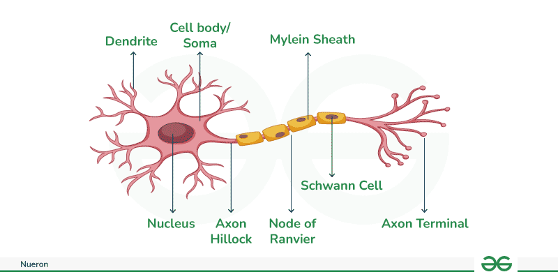
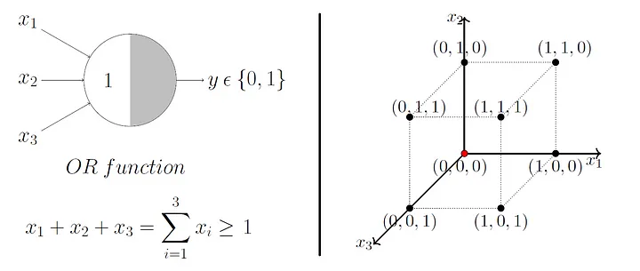
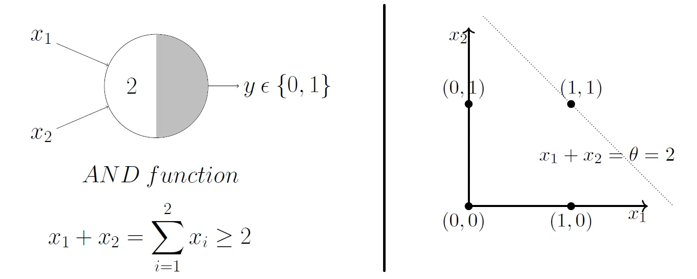
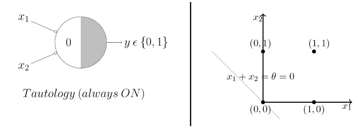
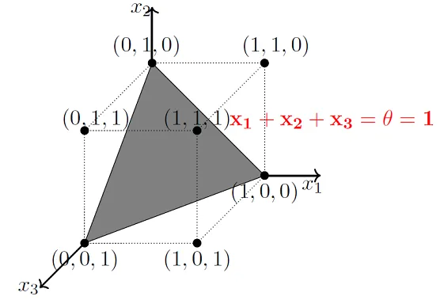
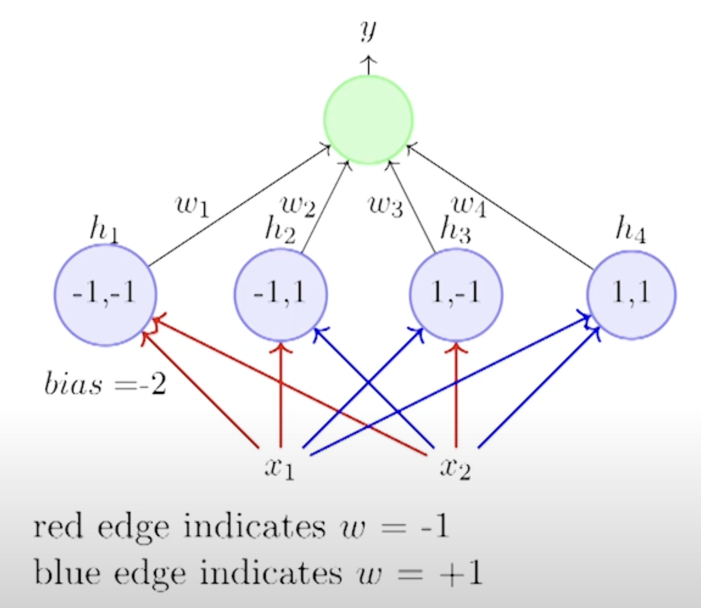

# Lectures 2.1-2.8

## Lecture 2.1
1. What are biological neurons?
    - they are neurological cells

2. What are the components of biological neurons?
    
    - dendrite: the branching structure receives signals from other neurons, like the branches of a tree receiving nutrients.

    - soma (cell body): the main body of the neuron containing the nucleus and other organelles. It integrates the signals recieved from the dendrites and prepares them for transmission. 

    - axon: this long cylindrical projection carries electrical signal (action potential) away from the soma. It can be insulated by a myelin sheath which speeds up the transmission of the signal.

    - synapse: this is the junction where one neuron communicates with another. At the axon terminal the  electrical signal triggers the release of neurotransmitters which travel across the synapse to the next neuron's dendrites, initiating a new signal

3. How do the above components of the biological neuron function together?
    - **Signal Reception**: incoming signals arrive at the neuron's dendrites.
    - **Signal Integration**: the soma receives and processes these signals.
    - **Signal Transmission**: if the signals are sre strong enough, an action potential is generates and travels down the axon.
    - **Signal Communication**: at the synapse the action potential triggers the release of neurotransmitters allowing the signal to be passed on to the next neuron.
    - **Next Neuron**: the neurotransmitters bind to receptors on the next neuron's dendrites initiating a new signal, and the process repeats.
   
## Lecture 2.2
4. What is the computational model proposed by Warren MuCulloch (neuroscientist) and Walter Pitts (logician) in 1943?
    - MuCulloch and Pitts proposed a higly simplified computational model (henceforth called MP neuron) of the neuron in 1943. 
    - A MP neuron takes two types of inputs: exhibitory $x_{i} \in \{0,1 \}$ for $i \in \{1, \ldots, n \}$ and inhibitory $u_i\in \{0,1 \}$ for $i \in \{1, \ldots, m \}$.
    - If an inhibitory input is $1$ then the output $y$ is zero
    - If all inhibitory inputs are zero then the MP neuron outputs a $y \in \{0,1 \}$ based on the aggregation $\sum_{i\in \{1, \ldots, n \}} x_i$ and threshold $\theta$.
    - Specifically 

    $$y = 1 \text{ if } u_i = 0 \forall i\in \{1, \ldots, m \} \text{ and } \sum_{i\in \{1, \ldots, n \}} x_i \geq \theta  $$ 
    $$ = 0 \text{ otherwise}$$

4. What are threshold functions?
    - the above description of MP neuron on exhibitory inputs is a threshold function.

**Note** MP neurons can capture boolean functions like: AND, OR, NOT but not XOR

5. What is the geometric interpretation of MP neuron?
         
    - consider the OR function on two inputs $x_1$ and $x_2$. 
    - this function outputs $1$ if $x_1 + x_2 \geq 1$.
    - MP neuron unit in particular outputs one if the input is above the line $x_1 + x_2 =1$ in the real plane.
     
    - similarly for AND function the MP neuron unit outputs one if the input is above the line $x_1 + x_2 =2$ in the real plane
    - similarly for tautology the output is one if the input point is above the line $x_1 + x_2 = 0$.
    
    - We call the points above as the positive halfspace, and the points below as the negative halfspace.
     
    - in the three dimensional case we have for the OR function that point should be in the positive halfspace defined by the hyperplane $x_1 + x_2 + x_3 = 1$

6. What are linearly separable boolean functions?
    - A boolean function is linearly separable if there exists a line (plane) such that all inputs which produce $1$ lie on one side of the line (plane) and all the inputs that produce $0$ lie on the other side.

7. What functions can MP neuron capture?
    - MP neuron functions exactly capture linearly separable boolean functions.

## Lecture 2.3

8. What are some of the limitations of MP neuron model?
    - does not capture non-boolean (say, real) inputs?
    - we have to determine the threshold apriori; no concept of learning them
    - All inputs are given equal weightage? What if we want to assign more weight to some inputs.
    - the computational model can only capture linear separable boolean functions. What about functions that are not linearly separable?

**Note** This lecture builds on the MP neuron model and introduces the percpetron model, which is also known as the aritficial neuron model. The perceptron addresses some of the above problems.

9. Explain the Perceptron model.
    - inputs $x_1, x_2, \ldots, x_n$ can be real numbers.
    - introduces weight parameters $w_i$ corresponding to every input $x_i$ and a threshold parameter $\theta$.
    - the model's output $y$ is 1 if $\sum_{i\in \{1, \ldots, n\} } w_i \cdot x_i \geq \theta$ and $0$ otherwise. Here as noted before $w_i$ for $i \in \{1, \ldots, n\}$ and $\theta$ are parameters that we set using all inputs and corresponding outputs we have.
    - the above equation can be written as $\sum_{i\in \{1, \ldots, n\}} w_i \cdot x_i - \theta \geq 0$ which can be rewritten as $\sum_{i\in \{0, \ldots, n\}} w_i \cdot x_i \geq 0$. Here, we fix $x_{0}$ as $1$ and $w_0$ captures $\theta$ which we learn.
    - $w_0$ is called the bias.

9. What kind of functions can be captured by the Perceptron and whether they are different from MC neurons?
    - Perceptron model is $\sum_{i\in \{0, \ldots, n\}} w_i\cdot x_i \geq 0$
    - The difference is in the weights and the ability to learn them, and we don't force the inputs to be boolean.

## Lecture 2.4

10. What is a dataset?
    - Suppose we are learning a function $f: \mathbb{R}^{n} \rightarrow \{0,1\}$
    - We have a bunch of $m$, $n$ dimensional points $\{x_{j,i} \}$ for $j\in \set{1, \ldots, m}$ and $i \in \{1, \ldots, n \}$.
    - We also have the corresponding outputs $y_j =f(x_{j,1}, \ldots, x_{j,n})$ for all the $m$ points.
    - The dataset $D$ consists of the $m$ input, output pairs $\{(\mathbf{x}_1, y_1) , \ldots, (\mathbf{x}_m, y_m) \}$, where $\mathbf{x}_j = (x_{j,1}, \ldots, x_{j,n})$
    - For example in the case of AND function on two inputs the dataset $D$ is $\{((0,0),0), ((0,1),0), ((1,0),0), ((1,1),1) \}$, where for example $\mathbf{x}_2 = (0,1)$ and $y_2 = 0$.

 11. What are error and error surfaces, and how does it connect to the perceptron model?
    - In the perceptron model, every choice of weights $w_0, \ldots, w_n$  defines a specific hyperplane in the input space. This hyperplane separates the space into two regions—typically representing binary output classes (e.g., $0$ and $1$). When we apply this hyperplane to a dataset of inputs, the model may misclassify some points, leading to error.
    - The error surface refers to a conceptual landscape over the space of weight parameters. For each combination of weights, we can compute the total classification error on the dataset. Plotting this error as a function of the weights results in an "error surface." The goal of training the perceptron is to find the set of weights $w_0, \ldots, w_n$​ that minimizes the error, that is, to locate the minimum point(s) on this surface.

## Lecture 2.5
**Goal**: Suppose we are given a list of $m$ movies and a label (class) associated with each movie indicating the user liked this movie or not: binary decision. Further suppose we represent each movie with $n$ features (some boolean, some real valued). For example these features could be as follows: 'isActorDamon', 'isGenreThriller', 'criticsRating' (scaled 0 to 1) and so on.

**Objective**: Learn the weights in the perceptron model such that if we give the feature vector corresponding to a movie the model outputs a $0$ or $1$ indicating whether the user likes it or not.

**Assumption**: $D$ is linearly separable

12. State the Perceptron Learning Algorithm for the above problem:
    1. Initialise $\mathbf{w}$ randomly
    3. While !convergence do
        - pick random $(\mathbf{x}, y) \in D$
        - if $y =1$ and $\mathbf{w}^T \mathbf{x} < 0$ then
            - $\mathbf{w} = \mathbf{w} + \mathbf{x}$
        - else if  $y =0$ and $\mathbf{w}^T \mathbf{x} >= 0$ then
            - $\mathbf{w} = \mathbf{w} - \mathbf{x}$
        - end if
    4. EndWhile

13. How is convergence defined in the above perceptron learning algorithm?
    - if the weights do not change on the training data then the algorithm has converged.

14. State angle between two $n$ dimensional vector.
    - The angle $\theta$ between two vectors satisfy the following relation:
        $$\cos \theta =  \frac{{x}^T\mathbf{y}}{||\mathbf{x}|| ||\mathbf{y}||}$$
    - Note here that $\theta \in [0,\ldots,180]$. This is because $\cos \theta = \cos (360^0 -\theta)$ 

14. Define orthogonality of two vectors.
    - $\mathbf{x}$ and $\mathbf{y}$ are orthogonal if $\mathbf{x}^T\mathbf{y} = 0$.
    - it is easy to see that if the two vectors are orthogonal then $\cos \theta$ is $0$, where $\theta$ is the angle between them. This implies $\theta = 0$

14. What is the direction of the vector normal to a hyperplane?
    - Suppose $\mathbf{w}^T \mathbf{x} = 0$ defines the hyperplane. In particular the hyperplane $\mathcal{H}$ consists of all $\mathbf{x}$ satisfying $\mathbf{w}^T \mathbf{x} = 0$.
    - Then every vector in the hyperplane is orthogonal to $\mathbf{w}$.
    - In particular $\mathbf{w}$ is orthogonal to the hyperplane $\mathbf{H}$.
    - The direction of $\mathbf{w}$ is determined by all points in the positive halfspace, that is, it is determined by the set of $\mathbf{x}$ such that $\mathbf{w}^T \mathbf{x} \geq 0$.
    - It points in the direction of all the points in the positive half space and it makes an angle of less than $90^0$ with all points in the positive half space.

14. Give intution as to why the above perceptron algorithm works?
    - suppose the random $(\mathbf{x}, y) \in D$ chosen is such that $y =1$ and $\mathbf{w}^T \mathbf{x} < 0$ then
        - the angle between $\mathbf{w}$ and $\mathbf{x}$ is greater than $90^0$ and we see that our update reduces this angle, that is
            $$ \cos \theta_{\text{new}} =  \frac{\mathbf{w}_{\text{new}}^T\mathbf{x}}{||\mathbf{w}_{\text{new}}|| ||\mathbf{x}||} = \frac{(\mathbf{w}+ \mathbf{x})^T\mathbf{x}}{||\mathbf{w}_{\text{new}}|| ||\mathbf{x}||} $$
        - since $\mathbf{x}^T\mathbf{x}$ is a positive quantity, this implies $\cos \theta_{\text{new}} < \cos \theta$ and hence $\theta_{\text{new}} > \theta$. Here $\theta_{\text{new}}$ and $\theta$ are the angle between the concerned vectors before and after the update.
        - the other case can be argued similarly.

## Lecture 2.6

15. When are the set of points in $D$ linearly separable?
    - When there is a $\mathbf{w}$ such that for all $\mathbf{x}, y$ with $y=1$, we have $\mathbf{w}^T \mathbf{x} \geq 0$ and for the remaining points we have $\mathbf{w}^T \mathbf{x} <0$

16. Prove the convergence of perceptron learning algorithm when $D$ is linearly separable.
    - To begin with since $D$ is linearly separable there is a $\mathbf{w}^*$ that can classify the points.
    - We make two transformations to $D$
        - Assume without loss of generality that all the points in $D$ are such that the $y$ corresponding to it is $1$. This can be done by considering $-\mathbf{x}$ if the $(\mathbf{w}^{*})^T \mathbf{x} < 0$.
        - We can also assume without loss of generality that the norms of all the data points $\mathbf{x}$ is 1, that is, we normalise the feature vector of all the data points. Notice that this does not change the label of the point.
    - Now oberve that owing to first of the two assumptions we have 
    $$\min_{\mathbf{x} \in D_{\mathbf{x}}} \mathbf{w}^T \mathbf{x} = \delta > 0 $$
    - in the above expression $D_{\mathbf{x}}$ only contains the feature vectors corresponding to every data point.
    - Suppose at time $t$, we see $\mathbf{x}, y$ such that $\mathbf{w}_t^T \mathbf{x} < 0$. Then after the update we have new weight vector $\mathbf{w}_{t+1}$. Let $\theta_{t+1}$ be the angle between $\mathbf{w}^*$ and $\mathbf{w}_{t+1}$
    $$\cos \theta_{t+1} = \frac{\mathbf{w}_{t+1}^T \mathbf{w}^*}{||\mathbf{w}_{t+1}||} $$
    $$\cos \theta_{t+1} = \frac{\mathbf{w}_{t}^T \mathbf{w}^* + \mathbf{x}^T \mathbf{w}^*}{||\mathbf{w}_{t+1}||} $$
    $$\cos \theta_{t+1} \leq \frac{\mathbf{w}_{t}^T \mathbf{w}^* + \delta}{||\mathbf{w}_{t+1}||} $$
    - Now suppose the update has been made for $k$ times uptil time $t+1$. Hence, we have 
    $$\cos \theta_{t+1} \leq \frac{\mathbf{w}_{0}^T \mathbf{w}^* + k\cdot \delta}{||\mathbf{w}_{t+1}||} $$
    - In the above equations, we have upper bounded the numerator. Now we lower bound the denominator
    $$||\mathbf{w}_{t+1}||^2 = \mathbf{w}_{t+1}^T \mathbf{w}_{t+1}$$
    $$||\mathbf{w}_{t+1}||^2 = ||\mathbf{w}_{t}||^2 + 2\mathbf{w}_t^T\mathbf{x} + ||\mathbf{x}||^2$$
    $$||\mathbf{w}_{t+1}||^2 = ||\mathbf{w}_{t}||^2 + 2\mathbf{w}_t^T\mathbf{x} + 1$$
    - We make the update because ${w}_t^T\mathbf{x} < 0$ and hence we have 
    $$||\mathbf{w}_{t+1}||^2 > ||\mathbf{w}_{t}||^2 + 1$$
    - Now similar to the numerator assuming there have been $k$ updates till time $t+1$ we have 
    $$||\mathbf{w}_{t+1}||^2 > ||\mathbf{w}_0||^2 + k$$
    - Using the above inequality for the denominator we have
    $$\cos \theta_{t+1} \leq \frac{\mathbf{w}_{0}^T \mathbf{w}^* + k\cdot \delta}{\sqrt{||\mathbf{w}_0||^2 + k}} $$
    - Now we see that $\cos \theta_{t+1}$ increases proportional to $\sqrt{k}$ and this implies at $k$ should be finite since the cosine function is at most $1$.

## Lecture 2.7 and 2.8

**Note**: Perceptron model only captures linearly separable functions. For example the XOR function cannot be captured by the perceptron model.

17. Show that any $n$ variable boolean function can be captured by a three layered perceptron, that is a perceptron with an input layer with $n$ nodes, one hidden layer of $2^n$ nodes and an output layer with one node.

    - The architecture is as explained in the question.
    - We will let the output node output 1 if it is true and -1 of it is zero. Similarly, the input node is -1 if the input is zero and 1 otherwise.
    - We set the bias of each node in the first computational layer to $-2$, and hardcode the weights as follows: let the weights to $i$-th node, for $i\in \{0, \ldots, 2^{n}-1 \}$ is determined by the $n$-length binary string of $i$. Let this binary string be $i_1, \ldots, i_n$, Then if $i_j$ is zero then the weight $w^{(1)}_{j,i}$ is $-1$ and otherwise it is equal to $1$.
    - It is easy to see that for every input configuration $i \in \{0, \ldots, 2^{n}-1 \}$ of the $\mathbf{x}$ variables only the $i$-th node in the hidden layer has output one.
    - Now for every boolean function, we can set the weights in the second layer appropriately to determine the boolean function.
    - For example if for input configuration $i \in \{0, \ldots, 2^{n}-1 \}$ the output is $1$ then we set $w^{2}_{i,1}$ is $1$ and $-1$ otherwise.

