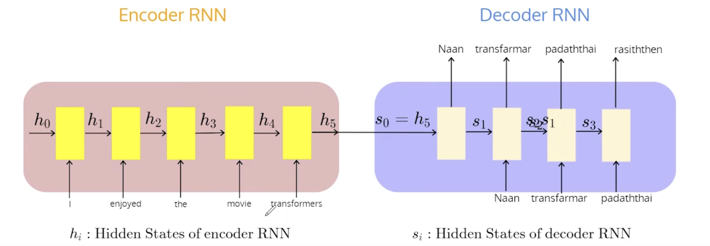

# Lectures 1-5

## Lecture 1
1. We have seen three types of architecture: RNN, CNN, and Feed-Forward Neural Networks.

2. The main objective of RNN was to perform sequence-to-sequence translation using an encode decoder architectute, and later we saw how this architecture can be generalised to various problems.

3. In RNN the computations the encoder computations are sequential. Even in attention RNNs we cannot compute the attention weights in parallel even though we have the input statement completely. The sequential computation enables the RNN to store context of the sequence.

4. The decoders are generated sequentially, and we cannot do much, as the word generated at $t-1$ is required at time-step $t$.

5. In the case of RNN once the intermediate representations of the encoder are dervied then we only need the attention weights to capture the input to the decoder. For example, if $h_{1}$, $h_2$, $\ldots$, $h_t$, are the representations, and $\alpha_{i,j}$ are the attention weights for $i, j\in \{1, 2, \ldots, 5 \}$ then the inputs to the decoder are the context vectors $c_1, \ldots, c_5$, where 
    $$c_i = \sum_{j \in \{2, \ldots, 5 \}}\alpha_{i,j}\cdot h_j$$

6. In an RNN for a given $i$ $\alpha_{i,j}$'s can be computed in parallel but across $i$'s we cannot. This is becuase to compute $\alpha_{i,j}$' we want the state of decoder at time-step $i-1$.

7. This motivates the transformer architecture: the idea is to come up with a new architecture that incorporates the attention mechanism and also allows parallelisation.

### Limitations of RNN

Encoder-Decoder Model in RNNs

1. Not able to parallel processing even though we have the sentence in one go! Thwe words are represented as vectors using embeddings, and processed sequentially to derive context. But this forces the processing to be sequential.

2. Hence, to avoid this sequential processing, we want a model that is not dependent on recurrent equation.

## Lecture 2 (Attention is all you need)

The attention based encoder-decoder model.

1. What are the similarities between the RNN and tranformer architectures?
    -  The input is a setence viewed as a sequence of tokens, and the output is computed by the decoder one at a time.
    - the embeddings are of the tokens are fed as input to the encoder. We are free to choose any embeding.
    - the output of the encoder are representations of each of the token. In particular if we give $T$ tokens as input in the form of $T$ word embedings then the outputs are $T$ representations corresponding to these $T$ tokens. 

Attention Matrix; the lighter the color higher the weight

Encoder and Decoder blocks of a transformer

2. What are the components of an encoder block?
    - self attention block (multi-head attention)
    - feed forward network

3. What are the components of a decoder block?
    - masked multi-head attention
    - cross-attention block (encoder-decoder attention)
    - feed forward network

**Note**: The transformer architecture typically has many encoder blocks stacked together to form the encoder. Similarly many decoder blocks are stacked together to form the decoder.

## Lecture 3 (Self Attention)
1. Explain the self-attention block.

Self-Attention Block
    - each word embedding is multplied with the weight-query matrix $W_q \in \mathbb{R}^{d \times d}$, weight-key matrix $W_k \in \mathbb{R}^{d \times d}$, weight-value matrix $W_v \in \mathbb{R}^{d \times d}$. Here $d$ is the size of the embedding.
    - Let $D \in \mathbb{R}^{T\times d}$ be the matrix where the token embedding are stacked row-wise. Hence $Q= D\cdot W_Q$, $K = D\cdot W_k$, and $V = D\cdot W_v$ are the query, key, and value matrices.
    - The attention weights are given as
    $$A = \frac{\mathsf{softmax}(Q\cdot K^T)}{\sqrt{d}} \in \mathbb{R}^{T\times d}$$
    - The computation of attention weights are called down by the dimension, and is called as scaled dot-product.
    That is each row of the above matrix gives us the attention weights corresponding to each row of the value matrix $V$.
    - Finally the representation computed at the end of the self-attention block is $A^{T}\cdot V$.

2. Explain how the self-attention block can be computed in parallel?
    - It is easy to see that once that for all the words in the input sequence, the word representations can be computed in parallel.
    - Using the words representations, the query $Q$, key $K$, and value $V$ matrices can be computed in parallel.
    - Using $Q$, $K$, $V$ the output of the self-attention block can be computed in parallel, that is each product term of $A^T \cdot V$ can be computed in parallel, and then can be summed up to output the inner-product.

## Lecture 4 (Multi-Head Attention)
#Diagram at 12:19.
1. Explain multi-head attention
    - Suppose $d$ is the size of representation output by the self-attention block.
    - Then we could have $m$ independent self-attention blocks of size $d/m$ contributing to the self-attention output.
    - In particular we have $W_{q_1}, \ldots, W_{q_m} \in \mathbb{R}^{d\times (d/m)}$, $W_{k_1}, \ldots, W_{k_m} \in \mathbb{R}^{d\times (d/m)}$, and $W_{v_1}, \ldots, W_{v_m} \in \mathbb{R}^{d\times (d/m)}$. 
    - We mulitply the word-embeddings to compute $m$ query, key, and value matrices, that is, we have $Q_i = D\times W_{q_i} \in \mathbb{R}^{T\times (d/m)}$, $K_i = D\times W_{k_i} \in \mathbb{R}^{T\times (d/m)}$, and $V_i = D\times W_{v_i} \in \mathbb{R}^{T\times (d/m)}$ for $i\in \{1, \ldots, m \}$,
    - We perform the self-attention operation independently to get 
        $$H_i = (\frac{\mathsf{Q}_i\cdot K_i^T}{\sqrt{d/m}})^T\cdot V_i $$
    - The $H_1, \ldots H_m$ are interleaved component-wise and then passed through a linear transformation to compute the attention output $H$.

**Note**: This induces a block-diagnol representation over how the attention weights are computed. Can we show that all such representations can indeed capture full-weight matrices used to compute attention. This question is akin to Jordan-Normal form?

2. What happens in the Feed-forward neural network.
Diagram at 17:19
    - Corresponding to each word representation output we get from multi-head attention block we apply the FFN of three layers (input, hidden, and output)
    - the input and output layers are of size $d$, and the hidden layer is of size $d_h > d$.
    - the non-linearity at the hidden layer can be anything for example GELU
    - the main point is that the FFN used for each word representation is the same.

## Lecture 5 (Teacher-Forcing and Masked Attention)